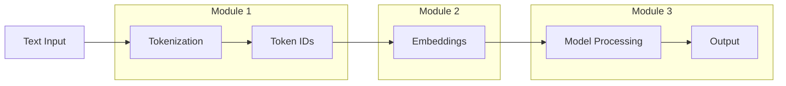

# 📚 Learning Path & Tutorial Sequence

This repository follows a progressive learning path through modern NLP concepts. Each module builds on concepts from the previous one.

---

## 🗺️ Overview

```
Module 1: LLM Inference & Tokenization
        ↓
Module 2: Text Embeddings  
        ↓
Module 3: Sentiment Analysis (Practical Application)
```

---

## 📦 Module 1: LLM Inference & Tokenization

**📁 Directory**: `01_llm_inference_tokenization/`  
**📅 Completed**: November 30, 2025

### What You'll Learn
- How Large Language Models (LLMs) generate text
- Causal LM (decoder-only) vs Seq2Seq (encoder-decoder) architectures
- KV cache optimization for faster inference
- How different tokenizers (WordPiece, BPE, SentencePiece) work
- Tokenizer efficiency comparison across multiple models

### Files (in order)

| # | File | Description |
|---|------|-------------|
| 1 | `01_phi3_inference.py` | Basic Phi-3 inference with custom KV cache wrapper |
| 2 | `02_flan_t5_inference.py` | Flan-T5 Seq2Seq model for translation tasks |
| 3 | `03_tokenizer_comparison.py` | Comprehensive tokenizer analysis across 7 models |
| 4 | `tokenizer_analysis.log` | Output log from the analysis |

### Key Concepts
- **Phi-3**: Microsoft's decoder-only causal language model
- **Flan-T5**: Google's instruction-tuned encoder-decoder model
- **Tokenization strategies**: WordPiece (BERT), BPE (GPT-2), SentencePiece (T5, Llama)

---

## 📦 Module 2: Text Embeddings

**📁 Directory**: `02_text_embeddings/`  
**📅 Completed**: December 2-3, 2025

### What You'll Learn
- How transformer models convert text to numerical vectors
- Difference between word-level and sentence-level embeddings
- Contextual embeddings vs static embeddings

### Files (in order)

| # | File | Description |
|---|------|-------------|
| 1 | `01_deberta_embeddings.py` | Generate contextual word embeddings using DeBERTa |
| 2 | `02_sentence_transformer.py` | Generate sentence embeddings for semantic similarity |

### Key Concepts
- **DeBERTa**: Word-level contextual embeddings (768-dim per token)
- **Sentence Transformers**: Sentence-level embeddings (768-dim per sentence)
- **Use cases**: Semantic search, clustering, similarity matching

---

## 📦 Module 3: Sentiment Analysis

**📁 Directory**: `03_sentiment_analysis/`  
**📅 Completed**: December 9, 2025

### What You'll Learn
- Running inference on real datasets
- Machine learning evaluation metrics (precision, recall, F1-score)
- Confusion matrix interpretation
- Zero-shot classification using LLMs
- Prompt engineering for classification tasks

### Files (in order)

| # | File | Description |
|---|------|-------------|
| 1 | `01_model_evaluation.py` | Evaluate a fine-tuned sentiment model with metrics |
| 2 | `02_llm_classifier.py` | Zero-shot sentiment classification using Ollama/LLMs |
| 3 | `README.md` | Detailed documentation for the LLM classifier |

### Key Concepts
- **Evaluation metrics**: Precision, Recall, F1-score, Accuracy
- **Confusion matrix**: Visualizing model predictions vs ground truth
- **Zero-shot classification**: Using LLMs without fine-tuning
- **Prompt engineering**: Crafting effective prompts for classification

---

## 🚀 Getting Started

### Prerequisites

```bash
pip install torch transformers datasets sentence-transformers scikit-learn matplotlib seaborn tqdm
```

### Running Each Module

```bash
# Module 1: LLM Inference
cd 01_llm_inference_tokenization
python 01_phi3_inference.py
python 02_flan_t5_inference.py
python 03_tokenizer_comparison.py

# Module 2: Embeddings
cd ../02_text_embeddings
python 01_deberta_embeddings.py
python 02_sentence_transformer.py

# Module 3: Sentiment Analysis
cd ../03_sentiment_analysis
python 01_model_evaluation.py
python 02_llm_classifier.py  # Requires Ollama running locally
```

---

## 📈 Progression of Concepts



---

## 📖 Recommended Reading Order

1. **Start with `README.md`** - Understand the overall tokenizer comparison results
2. **Module 1** - Run the inference scripts to see LLMs in action
3. **Module 2** - Understand how embeddings work
4. **Module 3** - Apply knowledge to a real classification task

---

*Last Updated: December 2025*
